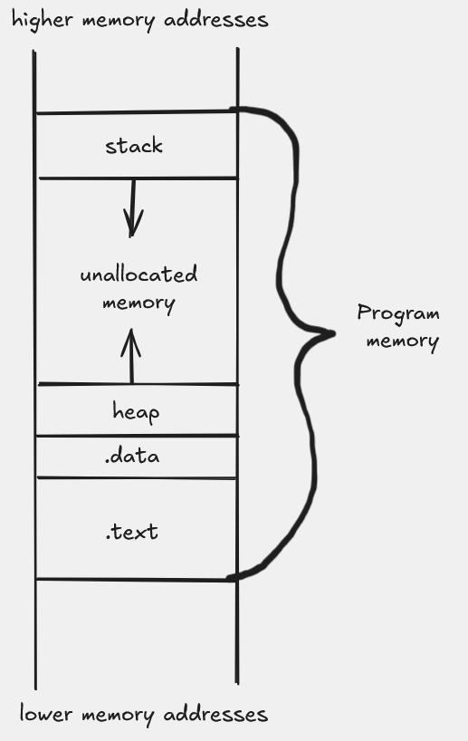
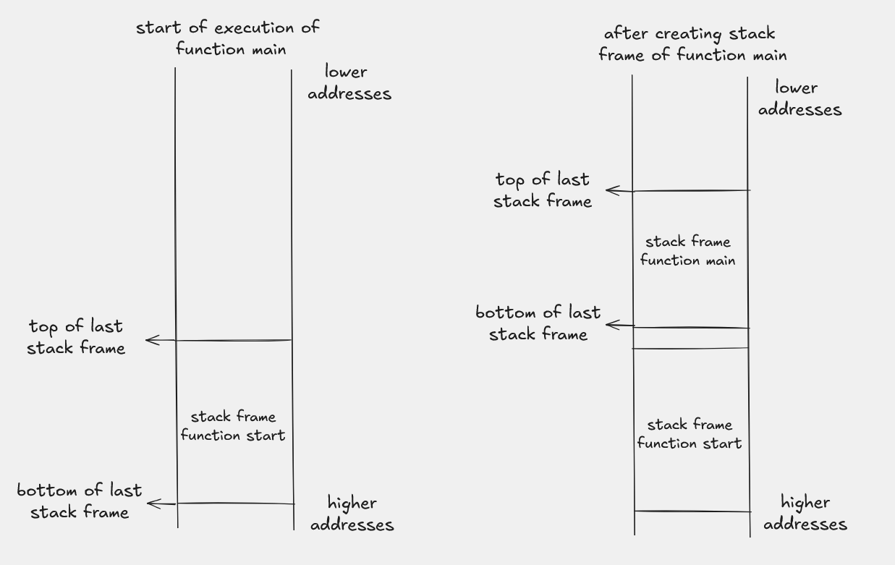
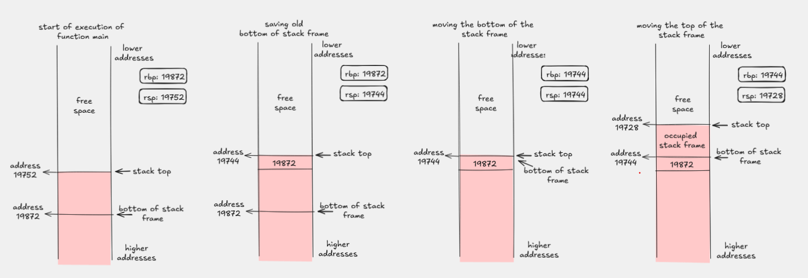
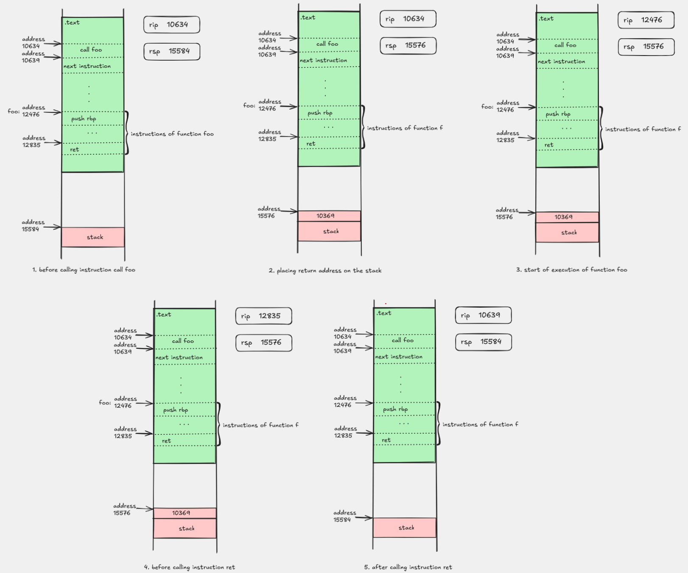

# Organization of executable code

## From source code to running a program

In the "Introduction to Programming" course you wrote your first programs in C++. In this course the goal is to understand a bit more closely how those programs actually run on a computer and what it is that the computer "sees" when we try to run a program.

Suppose you wrote a program in a file `program.cpp`. Running that program in the terminal might look like this:

```sh
$ g++ program.cpp
$ ./a.out
# interaction with the program
```

The command `g++ program.cpp` runs the compiler, which creates the file `a.out` for you. We can see what exactly that file is using the `file` program:

```sh
$ file a.out
a.out: ELF 64-bit LSB pie executable, x86-64, version 1 (SYSV), dynamically linked, interpreter /lib64/ld-linux-x86-64.so.2, BuildID[sha1]=75e5c89080bd36fc3098fa6f5b4e146f12f22b22, for GNU/Linux 3.2.0, not stripped
```

## What an `ELF` file is

Here we see several useful pieces of information. For now, the most important thing is that this is an `ELF 64-bit` file for the `x86-64` architecture.

`ELF` is short for `Executable and Linkable Format` and is the format that contains the information needed for a program to be run. When you execute the command `./a.out`, that information is read by a program called the loader, which uses it to prepare memory for executing the program.

One of the most useful ways to look at the internal structure of an `ELF` file is the command `readelf -S`:

```sh
$ readelf -S a.out
There are 31 section headers, starting at offset 0x3698:

Section Headers:
  [Nr] Name              Type             Address           Offset
  ...
  [16] .text             PROGBITS         0000000000001060  00001060
  [18] .rodata           PROGBITS         0000000000002000  00002000
  [25] .data             PROGBITS         0000000000004000  00003000
  [26] .bss              NOBITS           0000000000004010  00003010
  ...
```

In this output we see the sections that are actually written into the executable file itself. The ones especially important to us are:

- `.text`, which contains the program's instructions
- `.rodata`, which often contains constant data, for example strings
- `.data`, which contains initialized global and static data
- `.bss`, which contains uninitialized global and static data

If we want a similar overview in a somewhat more compact form, we can also use `objdump -h a.out`.

It is important to notice that we will not see `stack` and `heap` as sections in the output of `readelf -S`. They are memory regions used while the program runs, whereas `readelf` shows above all the structure of the `ELF` file itself.

## Basic memory regions

The loader takes a block of memory and divides it into several regions. The most important to us are the following:

- `.text` contains the instructions that are executed, that is, the program's machine code.
- `.data` contains data with static lifetime, such as global and static variables.
- `stack` contains data with automatic lifetime, most often local variables.
- `heap` contains dynamically allocated data, for example objects and structures created while the program runs.

### A short C++ example

The following example shows where different variables would most often end up:

```cpp
int globalna = 5;          // .data
int neinicijalizovana;     // .bss

int main() {
    static int staticka = 7;    // .data
    int lokalna = 10;           // stack
    int* dinamicka = new int(3); // the pointer is on the stack, the value on the heap

    return globalna + staticka + lokalna + *dinamicka + neinicijalizovana;
}
```

In this example:

- `globalna` has static lifetime and is located in the `.data` section.
- `neinicijalizovana` is also a global variable, but since it is not initialized, it usually ends up in the `.bss` section.
- `staticka` is local in scope but static in lifetime, so it is also placed in `.data`.
- `lokalna` is an ordinary local variable and is located on the stack.
- the variable `dinamicka` is a local pointer and is located on the stack.
- the value created by the expression `new int(3)` is located on the heap.

The following picture gives an intuitive view of how these parts of memory are laid out in a program:



*A view of a program's basic memory regions. The `heap` grows toward higher addresses, and the `stack` toward lower addresses.*

## Growth of the stack and heap

The `heap` and `stack` are sections that grow, but in opposite directions. The stack most often grows "downward", which means that newer data is located at addresses lower than the previous ones.

While writing assembly programs in this course we will pay attention to which section instructions and data are placed in.

## Stack frames

When a function is called, it often gets its own part of the stack in which it stores local variables and temporary values. We call that part of memory a **stack frame**.

In the classic form:

- `rbp` denotes the base of the current stack frame
- `rsp` denotes the top of the stack

That is why many functions begin with the pattern:

```asm
push rbp
mov rbp, rsp
sub rsp, ...
```

The first picture should give an intuitive idea of what a stack frame is and where `rbp`, `rsp`, the arguments and the local variables are located within it:



*A schematic view of a function's stack frame.*

### Building a stack frame step by step

It is also useful to see how the values of the `rbp` and `rsp` registers change while entering a function. For example:

1. before entering the function the stack belongs to the caller
2. after `push rbp` the old value of `rbp` is saved on the stack
3. after `mov rbp, rsp` the new stack frame gets its base
4. after `sub rsp, ...` space is reserved for local variables

The following picture should show that process step by step:




### Function call, return address and stack alignment

When one function calls another, the `call` instruction first writes the return address onto the stack and then transfers control to the called function. The `ret` instruction later reads that address from the stack and returns execution to the caller.

It is useful here to also mention the `rip` register (`instruction pointer`). It denotes the address of the instruction currently being executed, that is, the address to which the flow of execution will next be directed. When `call` is executed, the address of the next instruction is written onto the stack, that is, the place to which we should return after the called function, and then the address of the start of the called function is placed in `rip`. When `ret` is executed, the address at the top of the stack is loaded into `rip`, so the program continues exactly from the instruction following the previous `call`.

This means that on entry the function finds `rsp` shifted by 8 bytes relative to the state just before `call`. On a Linux `x86-64` system there is an important rule that just before every `call` the stack must be aligned to 16 bytes. That is why a function which itself calls other functions must carefully keep track of how it changes `rsp`.

In many examples the pattern

```asm
push rbp
mov rbp, rsp
```

is there not only for a cleaner stack frame, but also because `push rbp` often returns the stack to an alignment suitable for the next `call`. If after that we reserve more space with the `sub rsp, ...` instruction, that reservation must also preserve the correct alignment before the next function call.



*The picture shows the state of the stack just before `call`, after the return address is written, on entry into the called function and after `ret`.*

On the other hand, if a function does not call any other function and does not need space on the stack, it often does not need to build a stack frame at all. We often call such a function a **leaf function**, and we will see a first example of this in the [Addition](../01-addition/README.md) section.

## Transition to assembly

So far we have seen what an executable file looks like and which memory regions are most important to us while a program runs. However, to understand and write concrete assembly code, it is not enough to know only where data is located in memory.

The next step is to understand what the instructions directly operate on: which registers exist, how we access them, what operands look like and how a single line of assembly is even written. That is why in the next topic we move from talking about program structure to the [basic syntax of the `x86-64` architecture](./02-basic-x86-64-syntax.md).

## Next

- Next: [Basic syntax of the `x86-64` architecture](./02-basic-x86-64-syntax.md)
