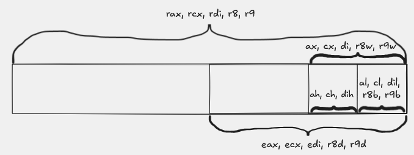
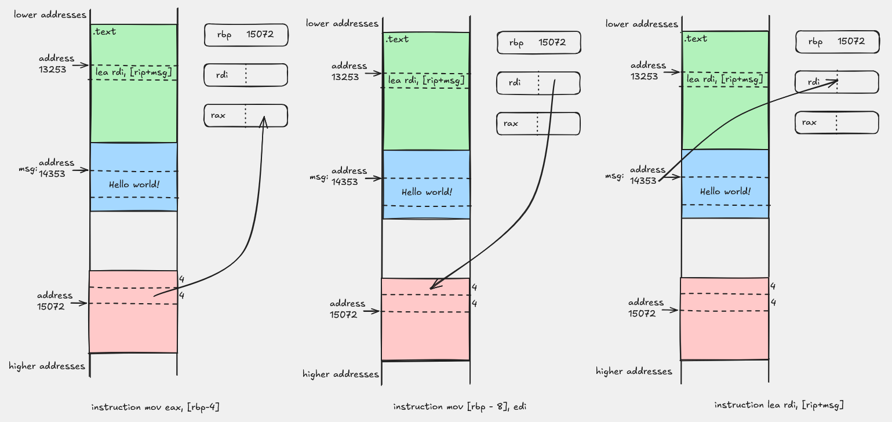

# Basic syntax of the `x86-64` architecture

## Architecture and assembly

Assembly is a very low-level language. Almost every instruction written is encoded directly into machine instructions that will be executed on the processor. That is why different processor architectures have different assembly languages.

In the first part of the course we will focus on Intel's `x86-64` architecture, which is dominant in the world of personal computers. The companies AMD and Intel make processors based on this architecture, so it is very likely that your computer also contains such a processor.

## General-purpose registers

The `x86-64` architecture is 64-bit, which means that memory addresses are represented with 8 bytes. In addition to main memory, which we access via addresses, the architecture also defines 16 64-bit general-purpose registers:

`rax`, `rbx`, `rcx`, `rdx`, `rdi`, `rsi`, `rbp`, `rsp`, `r8`, `r9`, `r10`, `r11`, `r12`, `r13`, `r14`, `r15`

Some of these registers have special purposes, but we will cover them in more detail later. When we do not want to work with eight-byte data, it is possible to access only part of a register. For example, the register `rax` can also be accessed as `eax`, `ax` or `al`, depending on the size of the data we are using.

In practice, at the beginning of the course we will most often encounter the following registers. The last column describes their common role when working on a Linux `x86-64` system, but keep in mind that we can use a register for other purposes too, if the instructions and the calling convention allow it.

| 64-bit | 32-bit | 16-bit | 8-bit | Common role |
| --- | --- | --- | --- | --- |
| `rax` | `eax` | `ax` | `al` | function return value; often also an accumulator in arithmetic |
| `rbx` | `ebx` | `bx` | `bl` | general-purpose register; often preserved across function calls |
| `rcx` | `ecx` | `cx` | `cl` | function argument; often a counter or helper register |
| `rdx` | `edx` | `dx` | `dl` | function argument; often a helper register in arithmetic |
| `rdi` | `edi` | `di` | `dil` | first integer or pointer argument of a function |
| `rsi` | `esi` | `si` | `sil` | second integer or pointer argument of a function |
| `rbp` | `ebp` | `bp` | `bpl` | base of the stack frame, if the function uses a frame pointer |
| `rsp` | `esp` | `sp` | `spl` | top of the stack |
| `r8`  | `r8d`  | `r8w`  | `r8b`  | fifth integer or pointer argument of a function |
| `r9`  | `r9d`  | `r9w`  | `r9b`  | sixth integer or pointer argument of a function |

The following picture shows how the parts of several commonly used registers are labeled:



*The picture shows that the same physical register can be viewed as a 64-bit, 32-bit, 16-bit or 8-bit register, depending on the instruction we use. The same pattern holds for the other general-purpose registers as well, not only for the examples shown.*

### Data size and subregisters

In examples with the `int` type we will most often use 32-bit subregisters such as `eax`, `edi` and `esi`, because `int` on a Linux `x86-64` system usually takes 4 bytes.

An important rule is the following: when an instruction writes a value into a 32-bit subregister, for example into `eax`, the upper 32 bits of the corresponding 64-bit register `rax` are automatically set to zero.

## Basic calling convention on Linux `x86-64`

For one function to be able to call another, both must agree on where the arguments arrive, where the result is returned and which registers they are allowed to clobber. We call these rules the **calling convention**.

In examples with integer and pointer arguments on a Linux `x86-64` system, the most important rules for us are the following:

| Role | Registers |
| --- | --- |
| First six integer / pointer arguments | `rdi`, `rsi`, `rdx`, `rcx`, `r8`, `r9` |
| Return value | `rax` |
| Registers a function must preserve if it changes them | `rbx`, `rbp`, `r12`, `r13`, `r14`, `r15` |
| Registers a function call may clobber | `rax`, `rcx`, `rdx`, `rdi`, `rsi`, `r8`, `r9`, `r10`, `r11` |

That is why in the example `sum_two(int a, int b)` the arguments arrive in `edi` and `esi`, and the result is returned via `eax`. In the example `puts(msg)` the address of the string arrives in `rdi`, since that is the function's first argument.

## Kinds of lines in assembly

In assembly, lines of code most often belong to one of the following groups:

- **Labels** are used to name parts of the code or memory. They consist of an identifier followed by a colon. The identifier can be any name that would also be valid for a variable in C++.
- **Directives** describe how the assembler should interpret the following part of the code. They begin with a dot and often do not represent processor instructions but rather instructions to the assembler.
- **Instructions** represent the actual operations that the processor will execute.
- **Comments** are used to explain the code and, in this dialect of assembly, begin with the `#` sign.

## Common directives

Some of the directives we will use often are:

- `.intel_syntax noprefix` specifies that we use Intel's dialect of assembly.
- `.text`, `.data`, `.rodata`, `.bss` specify which section the following instructions or data should be placed in.
- `.global name` indicates that the symbol `name` has external linkage and can be visible to other translation units.
- `.asciz`, `.quad`, `.byte` describe the size and form of the data being written.
- `.section .note.GNU-stack,"",@progbits` is not a processor instruction but a note to the tools during linking that the program does not need an executable stack.

## Kinds of operands

Instructions have a name and a certain number of operands. Some instructions have no explicit operands, while others use one, two or more of them. By type, operands can be:

- immediate, when we state the exact value, for example `42`
- register, when we state the register in which the value is located, for example `eax`
- memory, when we state an address or an expression that describes a location in memory, for example `[rdi + 4 * rcx]`

### Examples of memory operands

In the introductory examples we will often encounter forms such as:

- `[rbp-4]`, which means "the memory location 4 bytes below the base of the current stack frame"
- `[rbp-8]`, which means "the memory location 8 bytes below `rbp`"
- `[rip+msg]`, which means "the address of the symbol `msg` relative to the current instruction"

For example:

```asm
mov [rbp-4], edi
mov eax, [rbp-8]
lea rdi, [rip+msg]
```

In the first line we write the value from the register `edi` into memory. In the second line we load the value from memory into `eax`. Since the destination is `eax`, the assembler knows that we are dealing with 4 bytes. In the third line we do not read the contents of memory but compute the address of the symbol `msg`.



*The picture compares writing to memory, reading a value from memory and computing an address with the `lea` instruction.*

### `mov` and `lea` are not the same thing

The `mov` instruction usually moves the value itself. For example:
```asm
mov eax, [rbp-4]
```

means "read the value from memory at address `rbp-4` and write it into `eax`".

On the other hand,

```asm
lea rdi, [rip+msg]
```

means "compute the address of the symbol `msg` and write that address into `rdi`". That is why we very often use `lea` when we need to pass a function a pointer, rather than the contents at that address.

## The `call` and `ret` instructions

The instruction

```asm
call function
```

writes the return address onto the stack and transfers control to `function`.

The instruction

```asm
ret
```

reads that return address from the stack and returns execution to the caller.

That is why a function which calls some other function must keep track of the stack and its alignment. We will see this for the first time in the [Hello world](../02-hello-world/README.md) example.

## Next

- Previous: [Organization of executable code](./01-organization-of-executable-code.md)
- Next: [Addition](../01-addition/README.md)
- Source code of the first example: [main.cpp](../01-addition/main.cpp), [sum_two.s](../01-addition/sum_two.s), [sum_two-with-stack-frame.s](../01-addition/sum_two-with-stack-frame.s)
- The next example: [Hello world](../02-hello-world/README.md), [hello.cpp](../02-hello-world/hello.cpp), [hello.s](../02-hello-world/hello.s)
