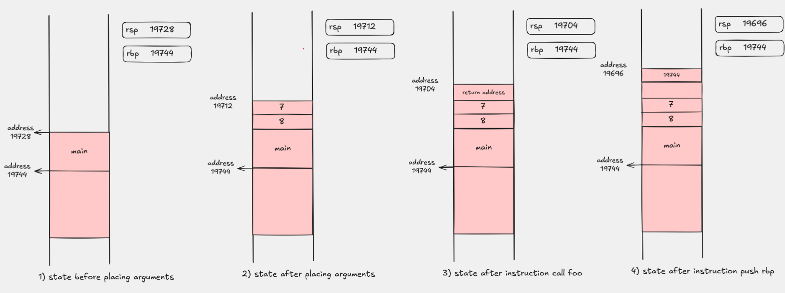

# Passing arguments

A reminder: we have already seen where the first six `int` arguments of a function end up. In this `x86-64` example they go, in order, into `edi`, `esi`, `edx`, `ecx`, `r8d`, and `r9d`.

Here we look at what happens after that: the seventh, eighth, and every following argument are placed on the stack, in reverse order.

## What the program does

`main.cpp` calls:

```cpp
foo(1, 2, 3, 4, 5, 6, 7, 8);
```

It then prints the return value of the function. The assembly function `foo` reads the eighth argument from the stack and returns it, so the program output is `8`.

## Files

- `main.cpp` calls `foo` with eight `int` arguments and prints the result
- `foo.s` builds a classic stack frame and reads the eighth argument via `[rbp + 24]`

## What you see in `main`

If we look at the disassembly of the `main` function, we will see the essence of the call:

```asm
push 8
push 7
mov r9d, 6
mov r8d, 5
mov ecx, 4
mov edx, 3
mov esi, 2
mov edi, 1
call foo
add rsp, 16
```

This clearly shows:

- the first six `int` arguments end up in registers
- the remaining arguments go on the stack in reverse order: first `8` is pushed, then `7`
- after the call the stack is cleaned up with the instruction `add rsp, 16`

We can also see this using the Compiler Explorer tool at the following link:

[https://godbolt.org/z/c4McWczcs](https://godbolt.org/z/c4McWczcs)


## Diagram of the argument layout

The following image shows the layout of the registers and the stack during the call to the function `foo`:




In this image we see the state of the registers and memory at four moments:

1. before setting up the arguments for `foo`
2. immediately before `call foo`
3. right after `call`, before `push rbp` in `foo`
4. after `push rbp`

In these phases you should notice:

- before `call`, the registers `edi`, `esi`, `edx`, `ecx`, `r8d`, `r9d` already hold the values `1` through `6`
- before `call`, `7` and `8` are already on the stack, with `7` at `[rsp]` and `8` at `[rsp+8]`
- right after `call`, the return address is at `[rsp]`, so `7` and `8` shift to `[rsp+8]` and `[rsp+16]`
- after `push rbp`, `7` and `8` are at the addresses `[rsp+16]` and `[rsp+24]`
    - after the instruction `mov rbp, rsp` we access these arguments via `[rbp+16]` and `[rbp+24]`

## What to watch for in `foo`

Since `foo` builds a classic stack frame:

```asm
push rbp
mov rbp, rsp
```

we read the eighth argument via:

```asm
mov rax, [rbp + 24]
```

This works because, after the frame is set up, the stack holds in order:

- the old value of `rbp` at `[rbp]`
- the return address at `[rbp+8]`
- the seventh argument at `[rbp+16]`
- the eighth argument at `[rbp+24]`

## Compilation

```sh
g++ -O0 main.cpp foo.s
```

## Running

```sh
./a.out
```

The expected output is:

```text
8
```

## What to pay attention to

- the exact instructions in `main` may vary slightly between compilers and optimization levels, but the layout of the arguments stays the same
- accessing arguments via the stack becomes important as soon as we go past six integer parameters

## Navigation

- Previous: [Week 2](../README.md)
- Next: [Maximum of two numbers](../02-max/README.md)
