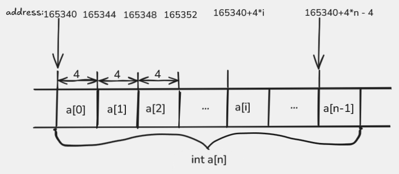

# Sum of array elements

This example introduces the most important pattern for working with an array: we have a base address, an index, and a scale that depends on the element size.

## What the program does

The program reads the length of the array, then its elements, and prints their sum.

A reference C++ function might look like this:

```cpp
int array_sum(int* arr, int n) {
    int sum = 0;
    for (int i = 0; i < n; i++) {
        sum += arr[i];
    }
    return sum;
}
```

## Files

- `main.cpp` reads `n`, then `n` elements, and calls `array_sum`
- `array_sum.s` iterates over the array and accumulates the sum in `eax`

## What to watch for in the assembly

The address of the first element arrives in `rdi`, and the number of elements in `esi`. We keep the index in `ecx`.

The key instruction is:

```asm
    add eax, [rdi + 4*rcx]
```

It means:

- start from the base address `rdi`
- move forward by `4 * i` bytes
- read the `int` at that address
- add it to the current sum in `eax`

This is a concrete case of the general pattern `base + index * element_size`.

A visualization of the same idea:



The picture shows that the base address stays the same, while the index determines how large an offset in bytes must be added to reach element `a[i]`.

Since one `int` takes up `4` bytes, the multiplier on the index is exactly `4`. It is also important that the processor always computes the offset in bytes: if `i = 3`, the element's address is not `rdi + 3`, but `rdi + 12`, since that is the address of element `a[3]`.

## Compilation

```sh
g++ main.cpp array_sum.s
```

## Running

```sh
./a.out
```

Example interaction:

```text
5
1 2 3 4 5
15
```

## What to pay attention to

- this is the first example where we keep one register as the array base and another as the index
- the form `[rdi + 4*rcx]` is that same `base + index * element_size` pattern that we will see often later in all the array tasks
- when the index is increased by `1`, the address does not move by `1` byte but by the size of one array element
- in this week, for array tasks the focus is on addressing elements, so we assume the input `n > 0`

## Navigation

- Previous: [Swapping two values](../01-swap/README.md)
- Next: [Array maximum](../03-maximum/README.md)
- Up: [Week 4](../README.md)
