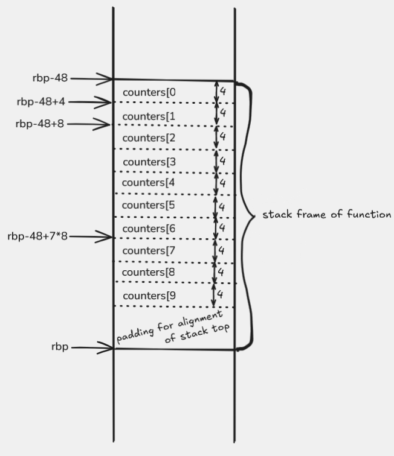

# Most frequent digit

This is the richest example of the week: inside the function we build a local array of counters, fill it, and then pass that array to a helper function that finds the index of the maximum element.

## What the program does

The program reads one `unsigned` number and prints the digit that appears the most times in its decimal representation.

If several digits have the same maximum frequency, the smallest of them is returned. This happens because the helper function returns the first index at which the maximum appears.

A reference C++ version might look like this:

```cpp
unsigned index_of_max(unsigned* a, unsigned n) {
    if (n == 0) {
        return 0;
    }

    unsigned index = 0;
    for (unsigned i = 1; i < n; i++) {
        if (a[index] < a[i]) {
            index = i;
        }
    }
    return index;
}

unsigned most_frequent_digit(unsigned n) {
    unsigned counters[10] = {};

    if (n == 0) {
        counters[0] = 1;
    }

    while (n != 0) {
        counters[n % 10]++;
        n /= 10;
    }

    return index_of_max(counters, 10);
}
```

## Files

- `main.cpp` reads the number and prints the result of the function `most_frequent_digit`
- `most_frequent_digit.s` builds a local array of counters and fills it
- `index_of_max.s` returns the index of the first maximum element in the array

## What to watch for in the assembly

This example is easiest to read in four clear phases.

### 1. Zeroing the local array of counters

In `most_frequent_digit` the local array of counters lives on the stack. That is why the function builds a larger stack frame:

```asm
    enter 48, 0
```

Of those `48` bytes:

- `40` bytes go to the `10` counters of type `unsigned`
- the remaining `8` bytes serve to keep the stack properly aligned before the `call`

A visualization of that stack frame:



The picture helps to clearly separate the `40` bytes for `counters[0]` through `counters[9]` from the additional `8` bytes that are there only because of stack alignment.

After that, the initialization loop writes zeros into all `10` elements of the local array.

### 2. The special case `n == 0`

If the input number is exactly `0`, we do not enter the loop with the division, but instead manually record that the digit `0` appeared once:

```asm
    mov dword ptr [rbp - 48], 1
```

### 3. Extracting a digit and incrementing the corresponding counter

When we extract the last digit, it ends up in `edx` as the remainder of the division by `10`, so we immediately use that remainder as an index into the array of counters:

```asm
    div r8d
    add dword ptr [rbp + 4 * rdx - 48], 1
```

This is the essence of the whole example: the remainder of the division by `10` is not just "the last digit", but also a direct index into the array `counters`.

### 4. Calling the helper function that finds the index of the maximum

After filling the counters we call the helper function:

```asm
    lea rdi, [rbp - 48]
    mov esi, 10
    call index_of_max
```

This nicely shows that we can treat the local array on the stack just like any other array: it is enough to pass the address of the first element.

In the case of a tie, the detail about ordering also matters: `index_of_max` updates the index only when it finds a strictly larger element. That is why, for the same number of occurrences, the earlier index remains, and in the array `counters[0] ... counters[9]` that means the smaller digit.

## Compilation

```sh
g++ main.cpp most_frequent_digit.s index_of_max.s
```

## Running

```sh
./a.out
```

Example interaction:

```text
2024050400
0
```

## What to pay attention to

- this is the first example in which we manually build a local array inside an assembly function
- the remainder of the division by `10` becomes the index of the digit we are counting
- the case `n = 0` must be handled separately, because the number `0` has one digit `0`
- the helper function is split into a separate file, so that "fill the counters" and "find the index of the maximum" are clearly separated
- "the first maximum" here means "the smallest digit with the maximum frequency", since the counters are ordered from `0` to `9`

## Navigation

- Previous: [Array maximum](../03-maximum/README.md)
- Next: [Reversing an array](../05-reverse-array/README.md)
- Up: [Week 4](../README.md)
