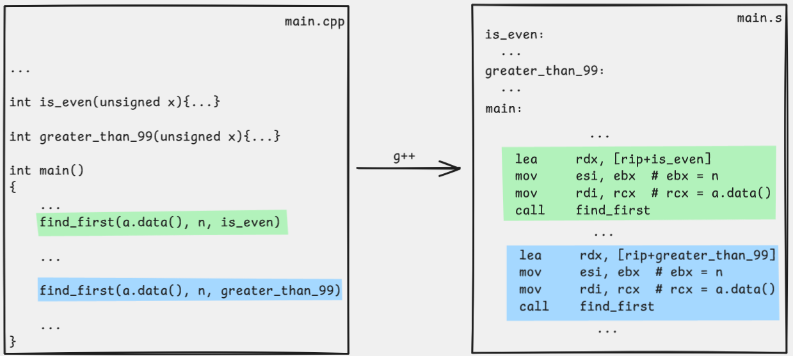

# Find first

This is an example in which a function receives the address of another function as an argument and then calls that function indirectly.

## What the program does

The `find_first` function goes through an array and returns the index of the first element that satisfies the passed predicate function. If no such element exists, it returns `-1`.

A reference C++ version could look like this:

```cpp
int find_first(unsigned* a, int n, int (*pred)(unsigned)) {
    for (int i = 0; i < n; i++) {
        if (pred(a[i])) {
            return i;
        }
    }
    return -1;
}
```

Early termination is part of the function's behavior: as soon as `pred(a[i])` returns a nonzero value, we return that index and do not look at the rest of the array. That is why the result is not just any match, but the index of the first element that satisfies the condition.

When from `main.cpp` we call `find_first(a.data(), n, is_even)`, the third argument is not the result of some check, but the address of the `is_even` function itself. `find_first` receives that address, stores it, and on each iteration calls it on the current array element.

## Files

- `main.cpp` reads the array and calls `find_first` with two different predicate functions
- `find_first.s` contains the assembly implementation of the function

## What to observe in the assembly

On entry to the function, the third argument, that is, the address of the predicate function, arrives in `rdx`. Since this is a value we need on every iteration, we store it in a local variable in the stack frame:

```asm
mov [rbp - 16], rdx
```

We do the same with the array base, the length, and the current index. This makes it easy to return to the same loop state after each `call`:

```asm
mov [rbp - 8], rdi
mov [rbp - 16], rdx
mov [rbp - 20], esi
mov dword ptr [rbp - 24], 0
```

Before the indirect call we place the current element `a[i]` into `edi`, exactly as if we were calling an ordinary named function. The `pred` function then returns its result in `eax`, by the same calling convention as any other function:

```asm
mov edi, [rax + 4 * rcx]
call [rbp - 16]
```

In `call [rbp - 16]` the target is not a symbol known by name, but the address of the function currently stored in memory at that position in the stack frame.

In the figure below we can see how this address is passed from the `main` function. With the `lea` instruction we write into the `rdx` register the address that the label with the function's name refers to (very similar to the [Hello world!](../../01-intro/02-hello-world/README.md) example).



> **Note:** The instructions we see in the figure may differ depending on the compiler and the options we use, but the semantic procedure of passing a function's address stays the same.


## Compilation

```sh
g++ main.cpp find_first.s
```

## Running

```sh
./a.out
```

Example interaction:

```text
6
11 15 18 21 130 7
first even: index 2
first > 99: index 4
```

## What to pay attention to

- this is the first example with an indirect `call`
- the predicate function still uses the same calling convention as any other function: argument in `edi`, return value in `eax`
- `-1` is a natural signal that no element satisfied the condition
- we keep the loop state in the stack frame precisely so that after each indirect `call` we can continue where we left off

## Navigation

- Previous: [Array range](../02-range/README.md)
- Next: [Recursive factorial](../04-factorial_recursive/README.md)
- Up: [Week 5](../README.md)
